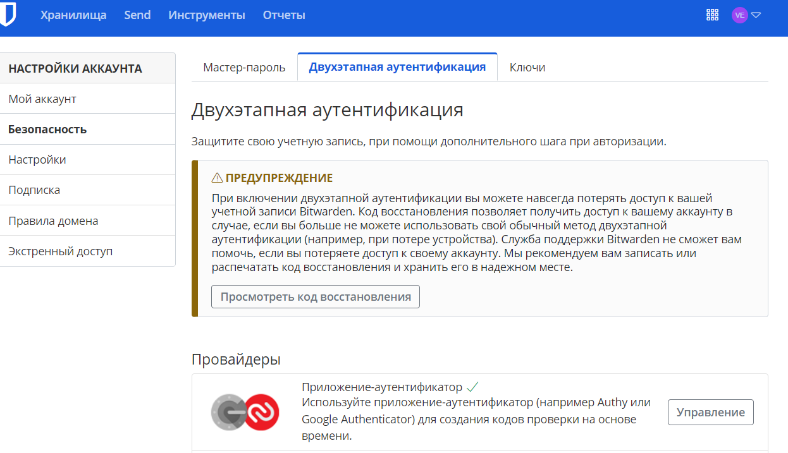

# Элементы безопастности информационных систем

1. Установите плагин Bitwarden для браузера. Зарегестрируйтесь и сохраните несколько паролей.


2. Установите Google Authenticator на мобильный телефон. Настройте вход в Bitwarden-акаунт через Google Authenticator OTP.



3. Установите apache2, сгенерируйте самоподписанный сертификат, настройте тестовый сайт для работы по HTTPS.

Установка apache2:

```bash
sudo apt update
sudo apt install apache2
```

Открытие портов http и https

```bash
sudo ufw allow "Apache Full"
```

Прежде чем использзовать SSL-сертификаты нужно включить mod_ssl:

```bash
sudo a2enmod ssl
sudo systemctl restart apache2
```

Создание SSL-ключа:

```bash
sudo openssl req -x509 -nodes -days 365 -newkey rsa:2048 -keyout /etc/ssl/private/apache-selfsigned.key -out /etc/ssl/certs/apache-selfsigned.crt
```

Настройка файла конфигурации:

```bash
sudo nano /etc/apache2/sites-available/127.0.1.1.conf
```

```bash
VirtualHost *:443>
   ServerName 127.0.1.1
   DocumentRoot /var/www/127.0.1.1

   SSLEngine on
   SSLCertificateFile /etc/ssl/certs/apache-selfsigned.crt
   SSLCertificateKeyFile /etc/ssl/private/apache-selfsigned.key
</VirtualHost>
<VirtualHost *:80>
        ServerName 127.0.1.1
        Redirect / https://127.0.1.1/
</VirtualHost>
```
Создание DocumentRoot и html файла в нем:

```bash 
sudo mkdir /var/www/127.0.1.1
sudo nano /var/www/127.0.1.1/index.html
```

Включение файла конфигурации и проверка ошибок конфигурации:

```bash 
sudo a2ensite 127.0.1.1.conf
sudo apache2ctl configtest
sudo systemctl reload apache2
```


4. Проверьте на TLS-уязвимости произвольный сайт в интернете (кроме сайтов МВД, ФСБ, МинОбр, НацБанк, РосКосмос, РосАтом, РосНАНО и любых госкомпаний, объектов КИИ, ВПК и т. п.).

```bash
./testssl.sh -U --sneaky https://google.com/
```


5. Установите на Ubuntu SSH-сервер, сгенерируйте новый приватный ключ. Скопируйте свой публичный ключ на другой сервер. Подключитесь к серверу по SSH-ключу.


6. Переименуйте файлы ключей из задания 5. Настройте файл конфигурации SSH-клиента так, чтобы вход на удалённый сервер осуществлялся по имени сервера.


7. Соберите дамп трафика утилитой tcpdump в формате pcap, 100 пакетов. Откройте файл pcap в Wireshark.


