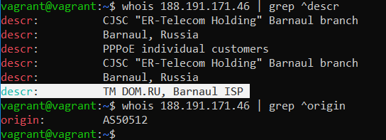

# Компьютерные сети - 1

1. Работа c HTTP через telnet.

* Подключитесь утилитой telnet к сайту stackoverflow.com: `telnet stackoverflow.com 80`
* Отправьте HTTP-запрос:

```bash
GET /questions HTTP/1.0
HOST: stackoverflow.com
[press enter]
[press enter]
```

Полученный HTTP-код:


Сервер понял запрос, но отказывается его выполнять. Авторизация не поможет и запрос повторять не следует.Этот код состояния обычно используется, когда сервер не хочет раскрывать, почему именно запрос был отклонен, или когда нет другого ответа.

2. Повторите задание 1 в браузере, используя консоль разработчика F12:

* откройте вкладку Network;
* отправьте запрос http://stackoverflow.com;
* найдите первый ответ HTTP-сервера, откройте вкладку Headers;
* укажите в ответе полученный HTTP-код;
* проверьте время загрузки страницы и определите, какой запрос обрабатывался дольше всего;
* приложите скриншот консоли браузера в ответ.

Полученный HTTP-код:


200 - это общепринятый код для успешного HTTP-запроса.


283 ms

3. Какой IP-адрес у вас в интернете?


 Будет использован DNS сервер resolver1.opendns.com с целью «перевести на понятный язык» имя хоста myip.opendns.com., превратив его именно в тот адрес, который и существует в реальности.

 4. Какому провайдеру принадлежит ваш IP-адрес? Какой автономной системе AS? Воспользуйтесь утилитой `whois`.

 

 5. Через какие сети проходит пакет, отправленный с вашего компьютера на адрес 8.8.8.8? Через какие AS? Воспользуйтесь утилитой `traceroute`.


 6. Повторите задание 5 в утилите `mtr`. На каком участке наибольшая задержка — delay?

 

 Наибольшая задержка на участке между 9 и 11 хопом.

 7. Какие DNS-сервера отвечают за доменное имя `dns.google`? Какие A-записи? Воспользуйтесь утилитой `dig`.

 

 8. Проверьте PTR записи для IP-адресов из задания 7. Какое доменное имя привязано к IP? Воспользуйтесь утилитой `dig`.

 

 