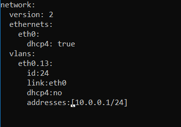

# Компьютерные сети 2

1. Проверьте список доступных сетевых интерфейсов на вашем компьютере. Какие команды есть для этого в Linux и в Windows?

Linux

Windows

2. Какой протокол используется для распознавания соседа по сетевому интерфейсу? Какой пакет и команды есть в Linux для этого?

Протоколы для распознания соседа по сетевому интерфейсу:

* LLDP
* CDP
* FDP
* NDP 
* LLTD

В линуксе используется пакет и сетевой интрфейс lldp, команда: lldpctl

3. Какая технология используется для разделения L2 коммутатора на несколько виртуальных сетей? Какой пакет и команды есть в Linux для этого? Приведите пример конфига.

Для разделения используется технология vlan

Так же можно использовать технологию iproute2

Пример конфига

После применения `netplan apply`

4. Какие типы агрегации интерфейсов есть в Linux? Какие опции есть для балансировки нагрузки? Приведите пример конфига.

- `balance-rr` - Политика round-robin. Пакеты отправляются последовательно, начиная с первого доступного интерфейса и заканчивая последним. Эта политика применяется для балансировки нагрузки и отказоустойчивости.
- `active-backup` - Политика активный-резервный. Только один сетевой интерфейс из объединённых будет активным. Другой интерфейс может стать активным, только в том случае, когда упадёт текущий активный интерфейс. Эта политика применяется для отказоустойчивости.
- `balance-xor` - Политика XOR. Передача распределяется между сетевыми картами используя формулу: [( «MAC адрес источника» XOR «MAC адрес назначения») по модулю «число интерфейсов»]. Получается одна и та же сетевая карта передаёт пакеты одним и тем же получателям. Политика XOR применяется для балансировки нагрузки и отказоустойчивости.
- `broadcast` - Широковещательная политика. Передает всё на все сетевые интерфейсы. Эта политика применяется для отказоустойчивости.
- `802.3ad` - Политика агрегирования каналов по стандарту IEEE 802.3ad. Создаются агрегированные группы сетевых карт с одинаковой скоростью и дуплексом. При таком объединении передача задействует все каналы в активной агрегации, согласно стандарту IEEE 802.3ad. Выбор через какой интерфейс отправлять пакет определяется политикой по умолчанию XOR политика.
- `balance-tlb` - Политика адаптивной балансировки нагрузки передачи. Исходящий трафик распределяется в зависимости от загруженности каждой сетевой карты (определяется скоростью загрузки). Не требует дополнительной настройки на коммутаторе. Входящий трафик приходит на текущую сетевую карту. Если она выходит из строя, то другая сетевая карта берёт себе MAC адрес вышедшей из строя карты.
- `balance-alb` - Политика адаптивной балансировки нагрузки. Включает в себя политику balance-tlb плюс осуществляет балансировку входящего трафика. Не требует дополнительной настройки на коммутаторе. Балансировка входящего трафика достигается путём ARP переговоров.
- `active-backup` на отказоустойчивость:

5. Сколько IP адресов в сети с маской /29 ? Сколько /29 подсетей можно получить из сети с маской /24. Приведите несколько примеров /29 подсетей внутри сети 10.10.10.0/24.

В сети с маской /29 6 IP адресов.

32 подсети /29 можно получить из сети с маской /24 - это можно узнать при помощи команды `ipcalc 10.0.0.1 255.255.255.0 255.255.255.248`:

6. Задача: вас попросили организовать стык между 2-мя организациями. Диапазоны 10.0.0.0/8, 172.16.0.0/12, 192.168.0.0/16 уже заняты. Из какой подсети допустимо взять частные IP адреса? Маску выберите из расчета максимум 40-50 хостов внутри подсети.

Можно взять адреса из сети для CGNAT - `100.64.0.0/10`.

Маска для диапазонов будет /26, она позволит подключить 62 хоста.

7. Как проверить ARP таблицу в Linux, Windows? Как очистить ARP кеш полностью? Как из ARP таблицы удалить только один нужный IP?

Проверить таблицу можно так:

* Linux: `ip neigh`, `arp -n`
* Windows: `arp -a`

Очистить кеш так:

* Linux: `ip neigh flush`
* Windows: `arp -d *`

Удалить один IP так:

* Linux: `ip neigh delete <IP> dev <INTERFACE>, arp -d <IP>`
* Windows: `arp -d <IP>`