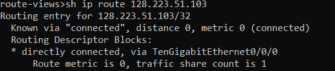
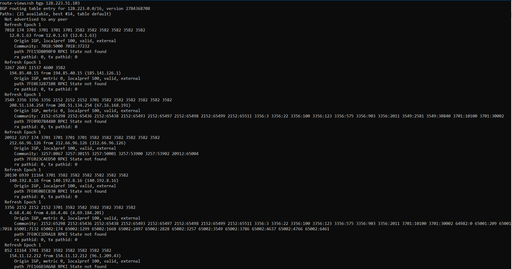
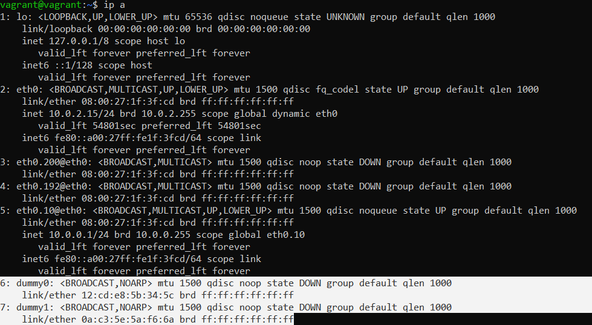
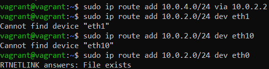
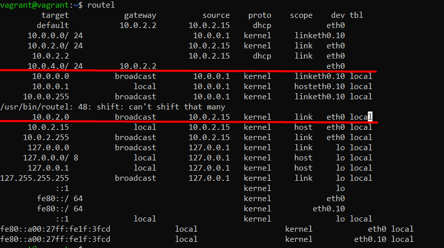
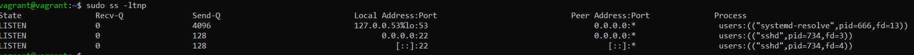
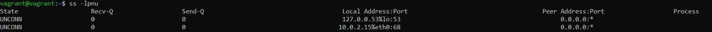

# Компьютерные сети 3
1. Подключитесь к публичному маршрутизатору в интернет. Найдите маршрут к вашему публичному IP.

2. Создайте dummy0 интерфейс в Ubuntu. Добавьте несколько статических маршрутов. Проверьте таблицу маршрутизации.

Создание интерфейсов dummy:

Добавление статических маршрутов и проверка таблицы маршрутизации:

3. Проверьте открытые TCP порты в Ubuntu, какие протоколы и приложения используют эти порты? Приведите несколько примеров.

53 - протокол DNS процесс systemd-resolve, 22 - протокол SSH процесс sshd

4. Проверьте используемые UDP сокеты в Ubuntu, какие протоколы и приложения используют эти порты?

53 - DNS, 68 - DHCP

5. Используя diagrams.net, создайте L3 диаграмму вашей домашней сети или любой другой сети, с которой вы работали.

