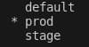
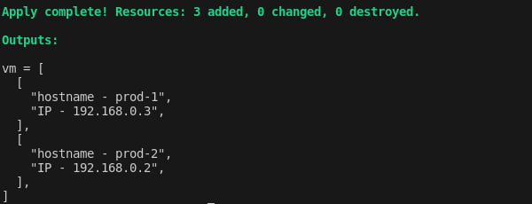

# Основы Terraform

## Вывод команды `terraform workspace list`



## Вывод команды `terraform plan` для workspace 'prod'

```bash
data.vcd_catalog.my-tmpl-cat: Reading...
data.vcd_catalog.my-tmpl-cat: Read complete after 1s [id=urn:vcloud:catalog:92b99631-e0b1-4dbc-992a-f19cbee034eb]
data.vcd_catalog_vapp_template.vappTmpl: Reading...
data.vcd_catalog_vapp_template.vappTmpl: Read complete after 1s [id=urn:vcloud:vapptemplate:813641e5-7aaa-4e40-94a2-0f72ec1686c6]

Terraform used the selected providers to generate the following execution plan. Resource actions are indicated with the following symbols:
  + create

Terraform will perform the following actions:

  # vcd_network_isolated.net will be created
  + resource "vcd_network_isolated" "net" {
      + dns1     = "1.1.1.1"
      + gateway  = "192.168.0.1"
      + href     = (known after apply)
      + id       = (known after apply)
      + metadata = (known after apply)
      + name     = "prod_net"
      + netmask  = "255.255.255.0"
      + org      = "Cortel_Viber_test"
      + shared   = false
      + vdc      = "Cortel_Viber_test"

      + static_ip_pool {
          + end_address   = "192.168.0.62"
          + start_address = "192.168.0.2"
        }
    }

  # vcd_vm.vm[0] will be created
  + resource "vcd_vm" "vm" {
      + accept_all_eulas               = true
      + computer_name                  = "prod-1"
      + cpu_cores                      = 2
      + cpu_hot_add_enabled            = false
      + cpu_limit                      = (known after apply)
      + cpu_priority                   = (known after apply)
      + cpu_reservation                = (known after apply)
      + cpu_shares                     = (known after apply)
      + cpus                           = (known after apply)
      + description                    = (known after apply)
      + expose_hardware_virtualization = false
      + guest_properties               = {
          + "local-hostname" = "prod - 1"
          + "user-data"      = "I2Nsb3VkLWNvbmZpZwoKZ3JvdXBzOgotIHVidW50dTogW3Jvb3Qsc3lzXQotIGNsb3VkLXVzZXJzCgp1c2VyczoKICAtIGRlZmF1bHQKICAtIG5hbWU6IHNlcmdleQogICAgZ2Vjb3M6IHRlc3Qgd2l0aCBTU0gga2V5IGNvbmZpZ3VyZWQKICAgIHNzaF9hdXRob3JpemVkX2tleXM6CiAgICAgIC0gc3NoLXJzYSBBQUFBQjNOemFDMXljMkVBQUFBREFRQUJBQUFCQVFETlIrWUIyL0l1empJWHRaM3g2NnptM2g5VmpFSDJ5eVNEVENBK1V5dzFkSW1KbjJVUUg5aEJtYlZ2VXpmRVhtTGVoejArSmlYQ1VXZjFCamtvbERKekVKUUc5b00xVm1JeFhwSnlaSGkxaUZ6c0xOb1FyMXdsL3JHWndNQUhhUFN2WU5reVZicUJJOStQRVpXQ2MkCiAgICBsb2NrX3Bhc3N3ZDogdHJ1ZQ=="
        }
      + hardware_version               = (known after apply)
      + href                           = (known after apply)
      + id                             = (known after apply)
      + internal_disk                  = (known after apply)
      + memory                         = 3096
      + memory_hot_add_enabled         = false
      + memory_limit                   = (known after apply)
      + memory_priority                = (known after apply)
      + memory_reservation             = (known after apply)
      + memory_shares                  = (known after apply)
      + metadata                       = (known after apply)
      + name                           = "prod-1"
      + os_type                        = (known after apply)
      + placement_policy_id            = (known after apply)
      + power_on                       = true
      + prevent_update_power_off       = false
      + security_tags                  = (known after apply)
      + sizing_policy_id               = (known after apply)
      + status                         = (known after apply)
      + status_text                    = (known after apply)
      + storage_profile                = (known after apply)
      + vapp_name                      = (known after apply)
      + vapp_template_id               = "urn:vcloud:vapptemplate:813641e5-7aaa-4e40-94a2-0f72ec1686c6"
      + vm_type                        = (known after apply)

      + customization {
          + admin_password                      = (sensitive value)
          + allow_local_admin_password          = true
          + auto_generate_password              = false
          + change_sid                          = (known after apply)
          + enabled                             = true
          + initscript                          = <<-EOT
                #!/bin/bash
                  growpart /dev/sda 3 #increase dev sda3
                  lvextend -l +100%FREE /dev/ubuntu-vg/ubuntu-lv #increase lvm
            EOT
          + join_domain                         = (known after apply)
          + join_domain_account_ou              = (known after apply)
          + join_domain_name                    = (known after apply)
          + join_domain_password                = (sensitive value)
          + join_domain_user                    = (known after apply)
          + join_org_domain                     = (known after apply)
          + must_change_password_on_first_login = (known after apply)
          + number_of_auto_logons               = (known after apply)
        }

      + network {
          + adapter_type       = (known after apply)
          + connected          = true
          + ip                 = (known after apply)
          + ip_allocation_mode = "POOL"
          + is_primary         = (known after apply)
          + mac                = (known after apply)
          + name               = "prod_net"
          + type               = "org"
        }

      + override_template_disk {
          + bus_number  = 0
          + bus_type    = "parallel"
          + iops        = 0
          + size_in_mb  = 20480
          + unit_number = 0
        }
    }

  # vcd_vm.vm[1] will be created
  + resource "vcd_vm" "vm" {
      + accept_all_eulas               = true
      + computer_name                  = "prod-2"
      + cpu_cores                      = 2
      + cpu_hot_add_enabled            = false
      + cpu_limit                      = (known after apply)
      + cpu_priority                   = (known after apply)
      + cpu_reservation                = (known after apply)
      + cpu_shares                     = (known after apply)
      + cpus                           = (known after apply)
      + description                    = (known after apply)
      + expose_hardware_virtualization = false
      + guest_properties               = {
          + "local-hostname" = "prod - 2"
          + "user-data"      = "I2Nsb3VkLWNvbmZpZwoKZ3JvdXBzOgotIHVidW50dTogW3Jvb3Qsc3lzXQotIGNsb3VkLXVzZXJzCgp1c2VyczoKICAtIGRlZmF1bHQKICAtIG5hbWU6IHNlcmdleQogICAgZ2Vjb3M6IHRlc3Qgd2l0aCBTU0gga2V5IGNvbmZpZ3VyZWQKICAgIHNzaF9hdXRob3JpemVkX2tleXM6CiAgICAgIC0gc3NoLXJzYSBBQUFBQjNOemFDMXljMkVBQUFBREFRQUJBQUFCQVFETlIrWUIyL0l1empJWHRaM3g2NnptM2g5VmpFSDJ5eVNEVENBK1V5dzFkSW1KbjJVUUg5aEJtYlZ2VXpmRVhtTGVoejArSmlYQ1VXZjFCamtvbERKekVKUUc5b00xVm1JeFhwSnlaSGkxaUZ6c0xOb1FyMXdsL3JHWndNQUhhUFN2WU5reVZicUJJOStQRVpXQ2MkCiAgICBsb2NrX3Bhc3N3ZDogdHJ1ZQ=="
        }
      + hardware_version               = (known after apply)
      + href                           = (known after apply)
      + id                             = (known after apply)
      + internal_disk                  = (known after apply)
      + memory                         = 3096
      + memory_hot_add_enabled         = false
      + memory_limit                   = (known after apply)
      + memory_priority                = (known after apply)
      + memory_reservation             = (known after apply)
      + memory_shares                  = (known after apply)
      + metadata                       = (known after apply)
      + name                           = "prod-2"
      + os_type                        = (known after apply)
      + placement_policy_id            = (known after apply)
      + power_on                       = true
      + prevent_update_power_off       = false
      + security_tags                  = (known after apply)
      + sizing_policy_id               = (known after apply)
      + status                         = (known after apply)
      + status_text                    = (known after apply)
      + storage_profile                = (known after apply)
      + vapp_name                      = (known after apply)
      + vapp_template_id               = "urn:vcloud:vapptemplate:813641e5-7aaa-4e40-94a2-0f72ec1686c6"
      + vm_type                        = (known after apply)

      + customization {
          + admin_password                      = (sensitive value)
          + allow_local_admin_password          = true
          + auto_generate_password              = false
          + change_sid                          = (known after apply)
          + enabled                             = true
          + initscript                          = <<-EOT
                #!/bin/bash
                  growpart /dev/sda 3 #increase dev sda3
                  lvextend -l +100%FREE /dev/ubuntu-vg/ubuntu-lv #increase lvm
            EOT
          + join_domain                         = (known after apply)
          + join_domain_account_ou              = (known after apply)
          + join_domain_name                    = (known after apply)
          + join_domain_password                = (sensitive value)
          + join_domain_user                    = (known after apply)
          + join_org_domain                     = (known after apply)
          + must_change_password_on_first_login = (known after apply)
          + number_of_auto_logons               = (known after apply)
        }

      + network {
          + adapter_type       = (known after apply)
          + connected          = true
          + ip                 = (known after apply)
          + ip_allocation_mode = "POOL"
          + is_primary         = (known after apply)
          + mac                = (known after apply)
          + name               = "prod_net"
          + type               = "org"
        }

      + override_template_disk {
          + bus_number  = 0
          + bus_type    = "parallel"
          + iops        = 0
          + size_in_mb  = 20480
          + unit_number = 0
        }
    }

Plan: 3 to add, 0 to change, 0 to destroy.

Changes to Outputs:
  + vm = [
      + [
          + "hostname - prod-1",
          + (known after apply),
        ],
      + [
          + "hostname - prod-2",
          + (known after apply),
        ],
    ]
```
## Вывод `outputs`



## Ссылка на файлы terraform

[Файлы terraform](/vm-template/terraform-files/ "Файлы terraform") 
